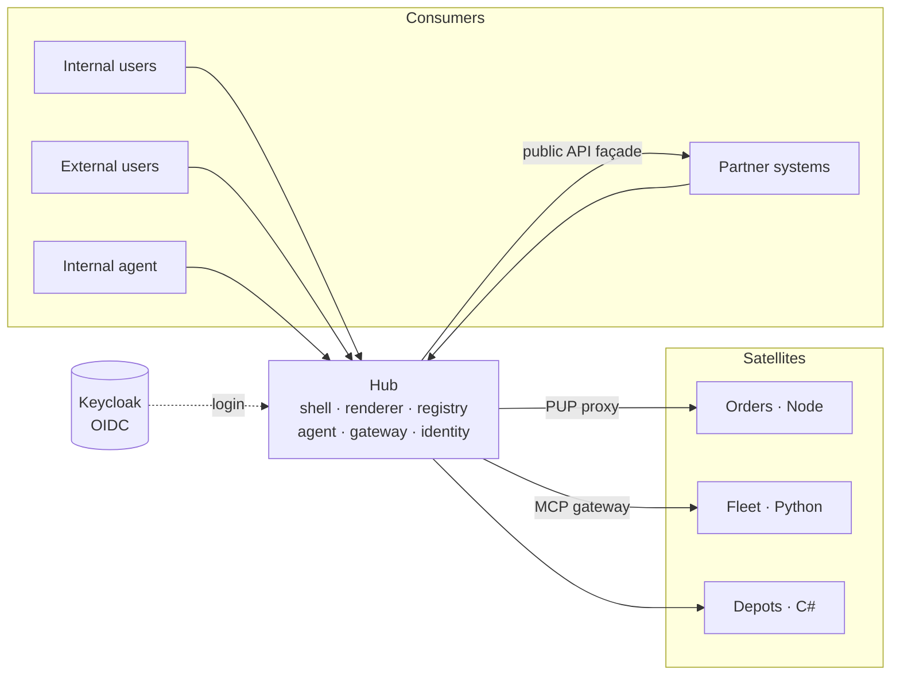
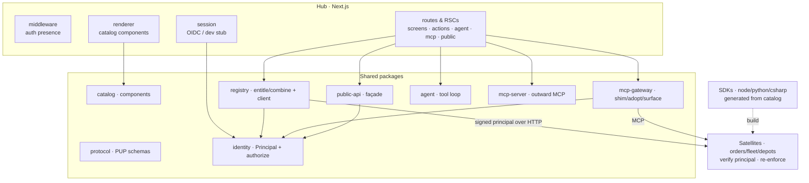
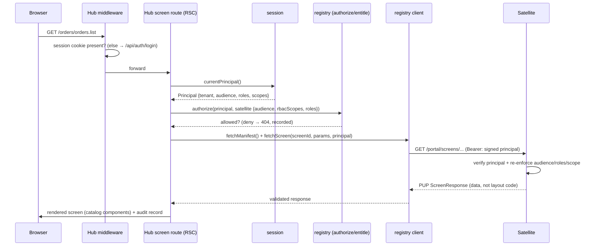
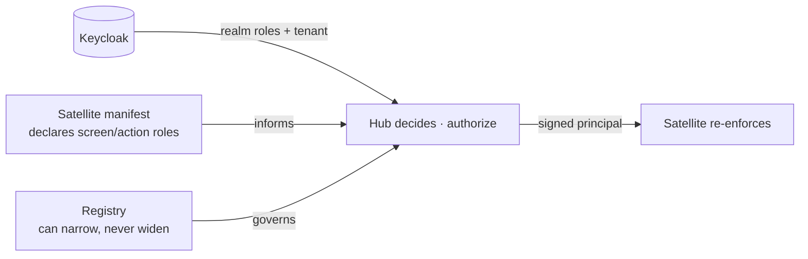
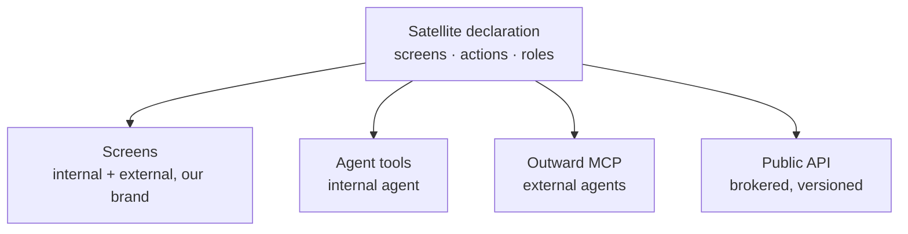
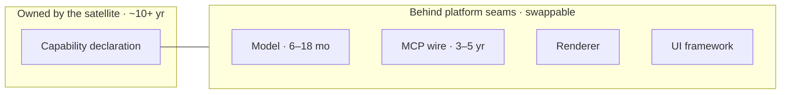

# Dynamic Portal — Architecture

> **Status:** Active · **Owner:** Platform team · **Last updated:** 2026-08-23
> **Audience:** engineers building the hub, a satellite, or an integration; reviewers; new joiners.
> **Related:** [`PLAN.md`](./PLAN.md) (vision & rationale) · [`README.md`](./README.md) (run it) · [`docs/DEMO.md`](./docs/DEMO.md) (guided demo) · [`config/satellites.yaml`](./config/satellites.yaml) (the registry).

This document describes *how the system is built and why*. It is the map you read before changing the shape of anything. For the bet the design makes, see `PLAN.md`; for how to run it, see `README.md`.

---

## 1. Overview

Dynamic Portal is a **capability platform**: a central **hub** renders the UI of many independent **solutions** from a declaration each solution owns, and projects that same declaration onto four surfaces — **interactive screens, internal agent tools, an outward MCP server, and a brokered public API**. Solutions ("satellites") send **data, not code**: they describe *what* to show (a table with these columns, a form with these fields, a chart of this series) in a fixed protocol, and the hub owns *how* it looks, the shell, navigation, branding, identity, and audit.

The single idea the whole system optimizes for: **the declaration is the durable asset, and everything that renders it is replaceable behind a seam.** Adding or changing a solution's screen requires zero hub deployments.

---

## 2. Goals and non-goals

**Goals**
- One declaration per solution → four consistent projections, with the marginal cost of solution #20 equal to solution #3.
- Uniform branding, shell, navigation, identity, and audit owned centrally; no per-solution front-end code.
- Tenancy, authorization (audience + org roles + scopes), and audit designed as *unchangeable* — the part you cannot refactor later.
- Polyglot satellites (Node, Python, C#) sharing only a wire contract, not a library.
- Every fast-decaying dependency (model, MCP wire, renderer, UI framework) behind a platform-owned seam.

**Non-goals**
- Bespoke per-solution UIs (canvas, maps, custom editors). The fixed 34-component vocabulary is what makes the model viable; solutions that need bespoke canvases are out of scope by design.
- Publishing the internal protocol (PUP) or MCP surface directly to partners — all external access is brokered and versioned separately.
- The hub as the single policy engine. Authorization is decided centrally but **re-enforced by every satellite**.

---

## 3. Core concepts

| Concept | Meaning |
|---|---|
| **PUP (Portal UI Protocol)** | The wire contract between satellites and the hub (`@portal/protocol`, v1.1). Zod schemas + generated types; screens, actions, params, audience, roles. |
| **Declaration / manifest** | What a satellite serves at `GET /portal/manifest`: its screens, actions, nav, and access metadata. The durable asset. |
| **Catalog** | The fixed component vocabulary (`@portal/catalog`, 34 components) the renderer understands. Additive-only. |
| **Projection** | A surface derived from the declaration: **Screens**, **Agent tools**, **Outward MCP**, **Public API**. |
| **Principal** | Who is asking, on whose behalf: `{ sub, tenantId, audience, scopes, roles }` (`@portal/identity`). Signed, cross-language. |
| **Registry** | `config/satellites.yaml` — the platform-owned governance file: which satellites exist, their scopes/roles/tools policy, and public projections. |
| **Satellite** | An independent solution service that serves PUP (and optionally its own MCP). |

---

## 4. High-level architecture

The hub is a Next.js application composed of workspace packages; satellites are independent services in any language that speak PUP over HTTP.

**Ownership split.** The **platform team** owns the catalog, PUP, hub, gateway, SDKs, conformance kit, public-API façade, and the registry. **Satellite teams** own their declarations, their authorization enforcement, and their data. Nobody else edits the catalog.

---

## 5. Components

### Hub (`apps/hub`, Next.js)
The shell, renderer, and every projection's entry point. Resolves the `Principal` (`src/lib/session.ts`), authenticates via OIDC (`src/lib/oidc.ts`) with a dev stub behind a flag, gates page navigations in `src/middleware.ts` (presence only), and hosts the route handlers for screens, actions, the agent, the outward MCP endpoint, and the public API. Renders PUP → React via the catalog.

### Shared packages (`packages/`)

| Package | Responsibility |
|---|---|
| `@portal/protocol` | PUP: Zod schemas, TS types, JSON-Schema export. The contract. Includes the `audience` and `role` axes. |
| `@portal/catalog` | The 34-component vocabulary the renderer accepts. Additive-only. |
| `@portal/identity` | `Principal`, the HMAC wire format, and **`authorize()`** — the one allow/deny decision. |
| `@portal/registry` | Loads `satellites.yaml`; **`entitle()`/`combine()`** (the composition rule); the HTTP client + circuit breaker to satellites. |
| `@portal/mcp-gateway` | Projects PUP → MCP tools (`shim`), adopts a satellite's own MCP tools (`adopt`), and builds the per-principal tool `surface`. |
| `@portal/public-api` | The brokered external façade — maps internal ids to stable public names, external-only. |
| `@portal/agent` | The agent tool loop, strict render schema, grounding validation, provenance. |
| `@portal/mcp-server` | The hub's aggregated outward MCP server. |
| `@portal/conformance` | CLI that checks a satellite against PUP + audience/role rules before the hub ever sees it. |
| `@portal/sdk-node` / `sdk-python` / `sdk-csharp` | Typed manifest/envelope builders, **generated from the catalog** so no vocabulary is hand-copied. |

### Satellites (`apps/satellite-*`)
Independent solution services, each in a different language to keep the polyglot claim honest:
- **orders** — Node/Express — tables, forms, workflow; **hosts its own MCP server** (the case a shim can't cover).
- **fleet** — Python/FastAPI — dashboard + charts; **no MCP** (the case that keeps the shim exercised).
- **depots** — C#/ASP.NET — capacity/status; **no MCP**.

Each satellite **independently verifies the signed principal and re-enforces authorization** (audience, roles, scopes) on every call.

---

## 6. Request lifecycle

A screen request, end to end:

Actions (writes), the agent, the outward MCP endpoint, and the public API follow the same spine: resolve principal → decide centrally → call the satellite with the signed principal → satellite re-enforces → audit.

---

## 7. Identity, authorization, and tenancy

> This is the part designed as if unchangeable. Get it wrong and no clean layering saves you.

### 7.1 Three axes, one decision

Every access decision is expressed by a single function, **`authorize(principal, target)`** in `@portal/identity`, over three axes:

| Axis | Semantics | Owner | Default |
|---|---|---|---|
| **audience** (`internal` / `external`) | membership; the target lists who it's exposed to | satellite + registry | absent ⇒ `[internal]` (**fail-closed**) |
| **roles** (leadership / engineering / finance / platform) | **any-of**; the principal holds one of the named roles | **satellite declares**, registry narrows | absent ⇒ un-gated (**opt-in**), internal principals only |
| **scopes** (`orders.read`, `orders.write`, …) | **all-of**; every named scope is required | registry (platform) | absent ⇒ none required |

The decision order is **audience → roles → scopes**, so a wrong-audience caller learns nothing about the roles or scopes a resource requires.

### 7.2 The composition rule (one function, six call sites)

The same question — *given a satellite, something declared inside it, and possibly a registry policy about it, may this principal have it?* — is answered by **`entitle()`/`combine()`** in `@portal/registry`, applied at six surfaces (protocol screen check, registry tool check, hub per-screen enforcement, manifest-vs-registry check, MCP gateway, public façade):

- **audience narrows** — the intersection of every enclosing layer; an inner declaration can never widen an outer one.
- **scopes accumulate** — the union; an inner policy adds a demand, never relieves an outer one.
- **roles narrow, but opt-in** — a layer that declares no roles is *no opinion* and drops out of the intersection; only when a layer declares roles is there a ceiling. `undefined` (un-gated) stays distinct from `[]` (nobody). This is the load-bearing subtlety: treating "absent" as "empty" would either deny everyone or stop the platform from adding a first restriction.

### 7.3 Best-practice model: declare, decide, enforce

The design follows the industry pattern — *the resource declares, the center decides, everyone enforces*:

- **Keycloak owns identity & role assignment.** Four realm roles; the hub is a confidential OIDC client.
- **Satellites inform** by declaring, per screen/action, which roles may see/do it — they never hold the decision.
- **The hub decides** at `authorize()` after mapping the token's claims into the `Principal` (`principalFromClaims`, `apps/hub/src/lib/oidc.ts` — roles from the access token, tenant from a user attribute).
- **The platform registry can narrow** a satellite's declared roles but never widen them (`config/satellites.yaml`).
- **Every satellite re-enforces** the decision itself. The redundancy is the point: if authorization lived only in the hub, one hub bug would be a cross-tenant disclosure across every solution at once; with satellite enforcement, a hub bug is an availability incident.

### 7.4 Authentication (OIDC) and the wire

The hub logs the user in at **Keycloak** (OIDC authorization-code + PKCE), exchanges the code, and maps verified claims into the same `Principal` every call already takes. A dev-session stub remains available behind `PORTAL_ALLOW_DEV_SESSION` (with `PORTAL_DEV_ROLES` to act as a role) for local work.

On the wire to satellites the hub currently signs the `Principal` (HMAC, shared across TS/Python/C# with a pinned cross-language token fixture). Replacing that leg with **RFC 8693 token exchange** verified against the issuer's JWKS is the planned next step and requires no call-site change — the `Principal` shape does not move. Because the signed principal is strict and cross-language, adding the `roles` claim forced a **rollout order**: satellites accept the claim first (optional), then the hub begins sending it.

### 7.5 Tenancy and audit

- **Tenant isolation** is enforced by every satellite on every call, keyed off `principal.tenantId`. A 403/404 on another tenant's record is indistinguishable from "does not exist."
- **Audit is a first-class, append-only schema** (`@portal/identity`), not a log format: principal, tenant, audience, satellite, screen/tool, parameter digest, outcome, latency, and the full tool-call chain for agent actions. Digests are **keyed per tenant** from a mandatory root secret (`PORTAL_AUDIT_KEY`); **writes fail closed** — a request that cannot be recorded fails. Refusals are recorded, but only once the principal is known.

---

## 8. The four projections

One declaration is projected onto four surfaces, each derived from and constrained by the same source:

- **Screens** — PUP → catalog components, rendered by the hub under its brand.
- **Agent tools** — screens become reads, actions become writes, via the PUP→MCP **shim**; a satellite with its own MCP server is **adopted** instead. Governance (`agentVisible`, `requiresConfirmation`, `rbacScopes`, `roles`) lives in the registry — the one place the zero-hub-deploy promise deliberately does not apply, because exposing a mutation to a model is a human decision made in a reviewed file.
- **Outward MCP** — the hub's aggregated, RBAC/audience/role-filtered tool surface as a single MCP server for external agents.
- **Public API** — a brokered façade that maps internal ids to stable public names, external-only, versioned independently so a satellite renaming a screen breaks no partner.

**A new projection in 2029 is one addition inside the hub — not 20 integration projects.**

---

## 9. Durability strategy

The architecture is a bet on dependency half-life: keep the long-lived thing (the declaration) stable and put everything short-lived behind a seam.

The declaration **cannot rot separately from the product** — it *is* the product's UI, so a team that stops maintaining it has stopped shipping UI (self-enforcing). Every fast-decaying dependency sits behind a platform-owned seam; no satellite imports one. A 2029 rewrite of the hub costs weeks, not a program, because the declarations do not move.

---

## 10. Deployment and runtime topology

Local/reference stack via `docker compose` ([`docker-compose.yml`](./docker-compose.yml)):

| Service | Tech | Port | Notes |
|---|---|---|---|
| hub | Next.js | 3000 | shell, renderer, projections; waits for all others healthy |
| satellite-orders | Node/Express | 4001 | PUP + own MCP |
| satellite-fleet | Python/FastAPI | 4002 | PUP only (shim) |
| satellite-depots | C#/ASP.NET | 4003 | PUP only |
| keycloak | Keycloak 26 | 8080 | OIDC IdP; imports the committed realm |

- The **registry is mounted, not baked in** — editing `config/satellites.yaml` and re-creating the hub picks up the change with no image rebuild, which is what makes "zero-deploy" true in the setup people actually try.
- **Config-as-code**: the set of solutions changes on a deploy cadence, so a reviewable/diffable/revertible file beats a table.
- **Keycloak hostname bridge**: the browser reaches Keycloak at `localhost:8080` (the issuer), the hub reaches it internally at `keycloak:8080`; the hub rewrites its own back-channel calls (`PORTAL_OIDC_INTERNAL_ORIGIN`).

---

## 11. Cross-cutting concerns

- **Resilience.** Per-satellite circuit breaker; a dead or invalid satellite renders a **scoped error card** while the rest of the portal keeps working. A satellite failing manifest validation at boot is disabled with a loud log — it never breaks the shell.
- **Trust boundary.** What crosses to a partner is records + a summary, never a UI tree and never the `ActionResponse` envelope (`patch`/`navigate` are renderer instructions a partner has no renderer for).
- **Determinism.** The catalog and the strict render schema mean an agent-composed or satellite-sent screen either validates against the vocabulary or is refused whole — never half-rendered.
- **Branding.** Palettes are CSS tokens in the hub; a rebrand re-creates the hub container (`docker compose up -d hub`), rebuilds nothing, and tells no satellite.

---

## 12. Testing and quality strategy

| Tier | What it proves |
|---|---|
| **Unit** (`vitest`, per package) | schema rules, `authorize`/`entitle` composition, the role axis, the renderer. |
| **Integration** (`*.integration.test.ts`) | hub routes + satellite apps end-to-end within a process. |
| **Cross-language** | a pinned signed-`Principal` token minted in TS and verified in Python **and** C#, so the three implementations cannot silently diverge. |
| **Conformance** (`@portal/conformance`) | a satellite speaks PUP + honours audience/role rules before the hub ever renders it. |
| **`sdk:check`** | the generated Python/C# SDKs match the catalog — the vocabulary cannot drift across languages. |
| **e2e** (`playwright`) | the deployed stack: navigation, deep links, scoped error cards, the conformance kit against every satellite, and the OIDC login flow. |

**Conventions:** TDD (red-green-refactor); a branch per feature, PR into `main`, no merge without review and green CI; the catalog is additive-only.

---

## 13. Known limitations & roadmap

- **RFC 8693 token exchange + JWKS** verification per satellite is the next step; today the hub signs an HMAC `Principal` on the wire (see §7.4).
- **Scopes under OIDC** are granted as a fixed internal set; roles are the demonstrated axis. Per-role or claim-sourced scope provisioning is a follow-up.
- **Per-screen roles are re-enforced satellite-side by orders**; fleet and depots apply the satellite-level role gate only (benign for the current matrix, since neither declares narrower per-screen roles).
- Parked until a consumer exists: MCP→PUP generation for a tools-only satellite, third-party SaaS MCP path.

---

## 14. Glossary

- **PUP** — Portal UI Protocol, the satellite↔hub wire contract.
- **Satellite** — an independent solution service the hub renders.
- **Projection** — a surface (screens / agent / MCP / public API) derived from a declaration.
- **Principal** — the authenticated identity: sub, tenant, audience, scopes, roles.
- **Audience / Roles / Scopes** — the three authorization axes (§7.1).
- **Registry** — the platform-owned governance file (`config/satellites.yaml`).

## 15. References

- [`PLAN.md`](./PLAN.md) — the vision, the durability thesis, and the rationale behind every decision here.
- [`README.md`](./README.md) — requirements, getting started, configuration.
- [`docs/DEMO.md`](./docs/DEMO.md) — a guided walkthrough.
- [`config/satellites.yaml`](./config/satellites.yaml) — the registry, with inline commentary.
